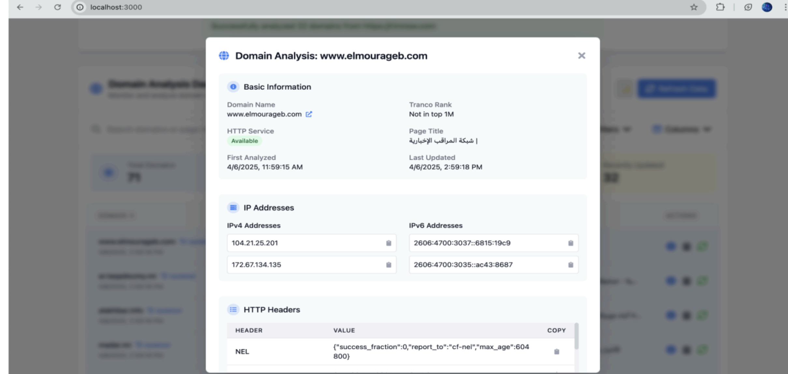

Domain Analyzer

A comprehensive data pipeline and visualization tool for generating metadata about domain names.

📸 Screenshots

<table width="100%">
<tr>
<td align="center" width="50%"><b>Main Dashboard & Analysis</b></td>
<td align="center" width="50%"><b>Detailed Analysis Modal</b></td>
</tr>
<tr>
<td width="50%"></td>
<td width="50%"></td>
</tr>
</table>

Features

Extract domains from any website (showcased with rimnow.com)

For each domain, collect:

All IP addresses (IPv4 and IPv6)

Tranco list ranking (top 1 million sites)

HTTP/HTTPS service information (headers, cookies, page title)

Store all metadata in PostgreSQL database

Visualize results in a clean, interactive dashboard

Project Structure

domain-analyzer/
│
├── docker-compose.yml        # Orchestrates all services
│
├── backend/                  # Python backend for domain analysis
│   ├── Dockerfile
│   └── app/
│       ├── main.py         # Combined logic for DB, analysis and API
│       └── requirements.txt # Python dependencies
│
└── frontend/                 # NextJS frontend
    ├── Dockerfile
    ├── package.json
    └── src/
        ├── pages/
        │   └── index.js      # Main page with analysis dashboard
        └── components/
            └── Dashboard.js # Component for visualization

Getting Started

Prerequisites

Docker

Docker Compose

Installation

Clone the repository:

git clone [https://github.com/yourusername/domain-analyzer.git](https://github.com/yourusername/domain-analyzer.git)
cd domain-analyzer

Start the services:

docker-compose up -d

Access the application:

Frontend: http://localhost:3000

Backend API: http://localhost:8000

Usage

Analyze a URL: Enter a URL to extract and analyze all domains found on that page.

Analyze a Domain: Enter a specific domain name to analyze just that domain.

Analyze rimnow.com: Click the button to extract and analyze all domains from rimnow.com.

API Endpoints

GET /domains: Get all analyzed domains

GET /domains/{domain_name}: Get details for a specific domain

POST /analyze: Analyze a URL or domain

GET /analyze/rimnow: Analyze domains from rimnow.com

Technologies Used

Backend:

FastAPI (Python web framework)

SQLAlchemy (ORM)

PostgreSQL (Database)

DNS Python (IP resolution)

BeautifulSoup (HTML parsing)

Frontend:

Next.js (React framework)

Tailwind CSS (Styling)

SWR (Data fetching)

Infrastructure:

Docker

Docker Compose

License

MIT
